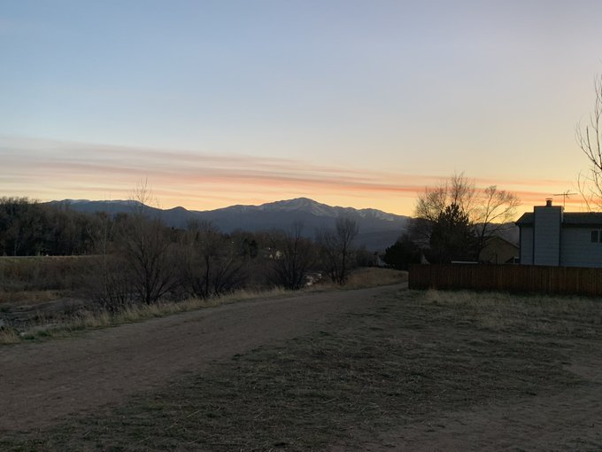

## PikesPeak
The main idea finding the flag using simple forensic techniques.


#### Step-1:
After we download `PikesPeak.jpg`, we try to open and see the flag and check if we find any.



#### Step-2:
I tried simple techniques and easily found answer when we send the command:

`strings PikesPeak.jpg | grep {`

I and got this as output:

```
CTFLEARN{PikesPeak}
CTFLearn{Colorado}
%ctflearn{MountainMountainMountain}
#cTfLeArN{CTFMountainCTFmOUNTAIN}
CTF{AsPEN.Vail}
CTFlearn{Gandalf}
ctflearning{AUCKLAND}
ctfLEARN{MtDoom}
6ctflearninglearning{Mordor.TongariroAlpineCrossing}
+CTFLEARN{MountGedePangrangoNationalPark}
$ctflearncTfLeARN{MountKosciuszko}
...
```

#### Step-4:

I tried all the flags up there xP.

However one of them worked out.

#### Step-5:
Finally the flag becomes:


[comment]: <> (`CTFlearn{Gandalf}`)
